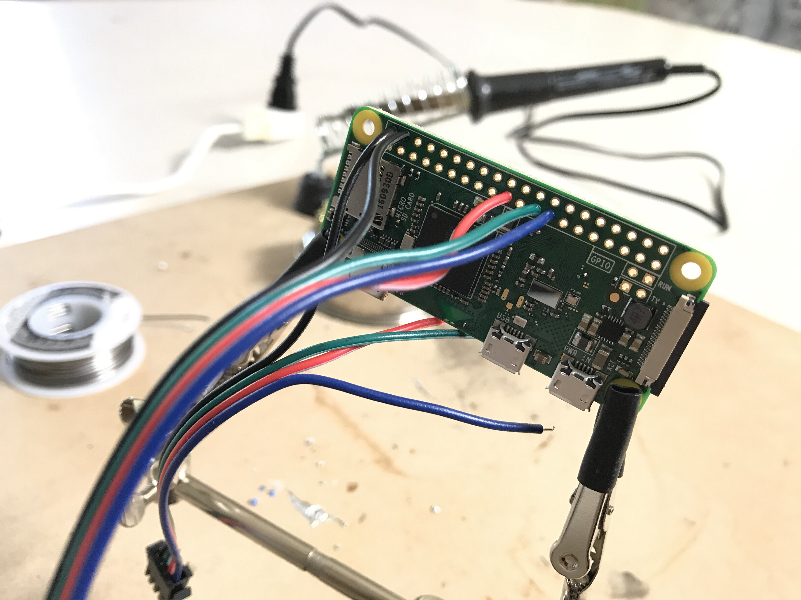

# Ossia DMX

Ossia DMX is a project that allows for DMX control over remote pixel LEDs. The system runs quite well on a Raspberry Pi, even the small Pi Zero W.

## Features

- Color and brightness control of APA102 pixels (also known as Adafruit DotStar LEDs)
- Up to 2 physically independent segments connected to the Pi
- Up to 8 logically independent sections per physical segment
- Power from the Pi's 5V supply
- Support for about 24 pixels (or more, at the risk of damage to the Pi)

## Use Cases

I needed DMX control of wireless, lighted stage props. Small elements like crystal balls, campfires, and candles were some of the first successes. Because of the conscious design to draw power from the Pi, Ossia DMX is best suited for small props. I wanted to keep the system compact so that each prop wouldn't be burdened with too much bulk from the electronics. 

## Hardware Requirements

A Raspberry Pi Zero W (or Zero with a Wi-Fi adapter), some 4-pin JST connectors, and some APA102 (DotStar) pixels are all that's required. My prop Pi's are powered by small USB battery packs, but you could use any source capable of supplying at least 2.0 A current.

## Warnings

Because I maintain this project for my own use as a theater technician, I'm only releasing it here as a courtesy to the community. I will make updates, but they will skew towards my use cases. Please feel free to use the code here and adapt it to your specific situation. If you'd like to make changes adapting it to a wider audience, I'll entertain them.

If you decide to use this project in a production environment, be warned: there are glitches. I make absolutely no guarantees that it won't crash and burn in a fiery mess. Currently, the project is documented poorly. As I make updates, I plan to improve this some. I am relatively new to programming and have learned most of it by trial and error (including GitHub).

## Setup

If you've read all the warnings and still want to try setting it up, see the [setup procedure](SETUP.md). You'll need some basic soldering skills. You'll also need some familiarity with the Linux terminal, but most of you here on GitHub checked that box a long time ago.

## Acknowledgements

This project would not be possible without the truly excellent [Open Lighting Architecture](https://www.openlighting.org/ola/).